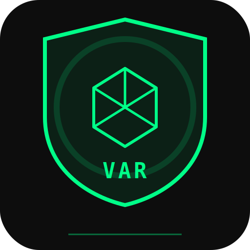

# ⚽ Pocket VAR

> **Single-phone VAR system for football matches.** Record, bookmark key moments, and review the last 60 seconds frame-by-frame — all from one Android device.



**Developer:** Nanbol Dassak ([@bolitupac](https://github.com/Bolitupac))

---

## Overview

Pocket VAR turns your phone into a pitchside VAR station. While recording a match, tap buttons to mark **GOAL**, **FOUL**, **OFFSIDE**, **YELLOW CARD**, or **RED CARD** events. After the action, hit **REVIEW** to scrub through the last 60 seconds of footage frame-by-frame, analyze calls, and save clips as evidence.

### Current Status — Checkpoint 3 ✅

Camera records live video, bookmark buttons stamp real timestamps during recording. Review screen loads the last 60 seconds of footage with a scrubbable timeline, frame-by-frame stepping, playback controls, and bookmark markers on the timeline.

---

## Tech Stack

| Layer | Choice |
|-------|--------|
| Framework | React Native (Expo SDK 56) |
| Camera | `expo-camera` + recorder |
| Playback | `expo-av` |
| Storage | `expo-file-system` + `expo-sqlite` |
| State | Zustand |
| Navigation | React Navigation (Native Stack) |
| Video Processing | FFmpeg (`ffmpeg-kit-react-native`) |
| Icons | `react-native-svg` (custom) |

## Project Structure

```
pocket-var/
├── App.js                    # Root — splash → navigator
├── app.json                  # Expo config
├── assets/                   # Icons, logo, splash
├── src/
│   ├── navigation/
│   │   └── AppNavigator.js   # Stack: Camera → Review → Clips → Settings
│   ├── screens/
│   │   ├── CameraScreen.js   # Main recording + bookmark buttons
│   │   ├── ReviewScreen.js   # Last 60s scrubber + frame stepping
│   │   ├── ClipsScreen.js    # Saved clip library
│   │   └── SettingsScreen.js # Quality, storage, camera prefs
│   ├── store/
│   │   └── useAppStore.js    # Zustand global state
│   └── theme/
│       └── index.js          # Colors, spacing, typography
```

## Screens

| Screen | Description |
|--------|-------------|
| **Camera** | Full-screen camera preview. Top bar has bookmark buttons (GOAL, FOUL, OFFSIDE, YC, RC, REVIEW). Bottom bar has record button, clips library, and settings. Recording shows elapsed timer with pulsing REC indicator. |
| **Review** | Video player with the last 60 seconds of the current recording. Scrubbable timeline with waveform visualisation. Frame-by-frame stepping (⏪ / ⏩). Play/pause. Bookmark markers plotted on the timeline. MARK FOUL / NO FOUL decision buttons. |
| **Clips** | Grid/list of all saved clips. Play, share, or delete. Filter by match or bookmark type. |
| **Settings** | Video quality (720p/1080p), camera facing, max review window, auto-save toggle, storage usage, data management. |

## Development Checkpoints

To survive network drops, each checkpoint is a **self-contained, runnable state**:

| # | Checkpoint | Status |
|---|-----------|--------|
| 1 | Project skeleton + theme + navigation + logo | ✅ |
| 2 | Camera screen — live preview, recording, bookmark timestamps | ✅ |
| 3 | Review screen — last 60s video, timeline scrub, frame stepping, bookmark markers | ✅ |
| 4 | SQLite database — bookmarks, matches, clips persistence | ❌ |
| 5 | Clips library — saved clips grid, play, share | ❌ |
| 6 | Polish — edge cases, permissions, splash, orientation, app icon | ❌ |

## Future Roadmap

- **AI Referee Analysis** — detect fouls, offsides, and goals using on-device ML
- **LAN Multi-Phone** — connect multiple phones via WebSocket, sync bookmarks in real-time for multi-angle VAR
- **Cloud Sync** — upload matches and clips to personal cloud storage
- **Payment / Premium** — subscription for AI features, extended cloud storage
- **Match Timeline Export** — auto-generated highlight reel with all bookmarked moments

## Getting Started

```bash
npm install
npm run android
```

Requires a physical Android device or emulator with camera access.

## Color Palette

```
Background:    #0D0D0D
Surface:       #1A1A1E
Primary Green: #00FF88
Text:          #FFFFFF
Text Dim:      #666670
Danger:        #FF3355
Warning:       #FFD700
Foul:          #FF6600
```

## Built With

- [Expo](https://expo.dev) SDK 56
- [React Navigation](https://reactnavigation.org)
- [Zustand](https://github.com/pmndrs/zustand)
- [react-native-svg](https://github.com/software-mansion/react-native-svg)

---

> **Pocket VAR** — your pocket-sized video assistant referee. ⚽  
> Developed by **Nanbol Dassak** ([@bolitupac](https://github.com/Bolitupac))
